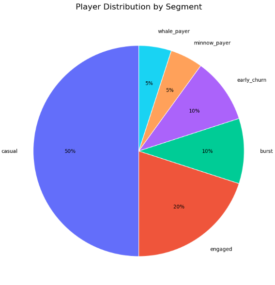
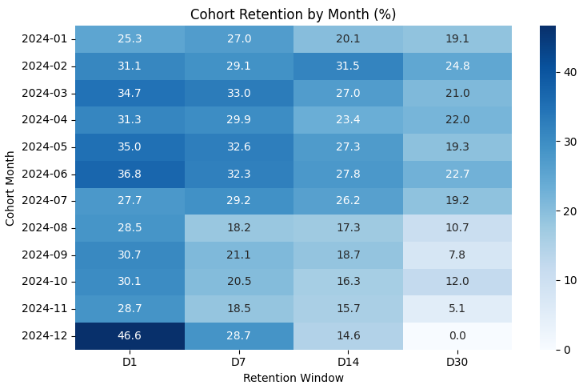
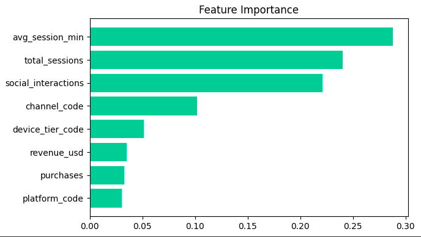

# Who Plays, Who Stays, Who Pays
Behavioral analytics for retention, monetization, and churn prediction in a social casino game.

---

Notebook can be found here:
[](https://colab.research.google.com/drive/1Nxp1lvYVci_Sbrxb4lLtc4PVTh87f4nL)

---

## Problem

Social casino games live or die by retention and by converting active players into payers. The goal of this analysis:
- Which player segments create the most value?
- What drives retention, and where does churn happen?
- Can churn be predicted from behavior alone — honestly, without leaking the answer into the features?

## Dataset Overview

The project uses several behavioral tables:

| Table | Description |
|---|---|
| players | player profile and segment |
| sessions | gameplay sessions |
| purchases | in-game transactions |
| social_interactions | player-to-player interactions |
| player_daily_activity | daily aggregated activity |

- ~3,000 players
- ~80,000 sessions
- ~11,000 purchases
- ~41,000 social interactions

## Method

1) Data validation and cleaning in BigQuery
2) Segment-level metrics in SQL (RFM + behavioral segmentation)
3) Cohort retention analysis (D1–D30)
4) Statistical testing of segment differences before reporting any "insight"
5) Churn prediction: Logistic Regression and Random Forest (scikit-learn)

Churn label (is_churned) was provided with the synthetic dataset. 
It is not a simple inactivity threshold: all retained players show recency_days = 0, 
While churned players range from 0 to 364 — meaning any recency_days > 0 guarantees the churn label.

## What Went Wrong First
The most useful parts of this project were the failures.

- Fan-out join. A direct join across player, session, purchase, and social tables multiplied rows and silently inflated revenue and activity metrics. Fix: aggregate each behavioral table separately, then join at the player level.
- A "perfect" churn model. The first Random Forest returned AUC = 1.0. That's not a result — it's a red flag. The features included lifetime_days and recency_days, which encode the churn label itself (target leakage): in this dataset, any recency_days > 0 guarantees is_churned = 1, so the model was simply reading the answer. After removing them and rebuilding the feature set, the models landed on honest numbers.
- Incomplete cohorts. The most recent cohorts (Nov–Dec 2024) lacked a full 30-day observation window; their retention figures were flagged and excluded from cross-cohort conclusions.


## Results


- Random Forest: AUC = 0.74 · Logistic Regression: AUC = 0.68 (after leakage fix; both down from a fake 1.0).
- Top churn predictors: avg_session_min, total_sessions, social_interactions — behavior beats monetization (revenue_usd, purchases near the bottom).
- Casual players ≈ half of the player base; whales and engaged players show the longest lifetimes and lowest churn.
- Socially active players demonstrate substantially longer lifetimes than non-social players.
- Retention declines consistently from D1 to D30 across cohorts.

## Visualizations










---

## Project Structure
```text
social-casino-case/

├── README.md

├── notebook/
│   └── Social_Casino_Case.ipynb

├── sql/
│   ├── player_segments.sql
│   ├── segment_summary.sql
│   └── cohort_retention.sql

├── data/
│   ├── raw/
│   │   ├── players.csv
│   │   ├── sessions.csv
│   │   ├── purchases.csv
│   │   ├── social_interactions.csv
│   │   └── player_daily_activity.csv
│   │
│   └── processed/
│       ├── player_segments.csv
│       ├── segment_summary.csv
│       └── cohort_retention.csv

└── images/
    ├── player_distribution.png
    ├── churn_rate.png
    ├── cohort_heatmap.png
    ├── social_activity_vs_lifetime.png
    ├── roc_curve.png
    └── feature_importance_v2.png
```
---

## Tech Stack

- **BigQuery**
- **Python Зandas** 
- **Scikit-learn** 
- **Plotly**
- **Matplotlib**
- **Seaborn**
  
---

## What I Learned

- Aggregate before you join — fan-out inflates everything downstream
- AUC = 1.0 means a broken pipeline, not a great model
- Incomplete observation windows quietly distort cohort comparisons
- Statistical testing before declaring segment "insights"
- Translating analytical findings into business recommendations
